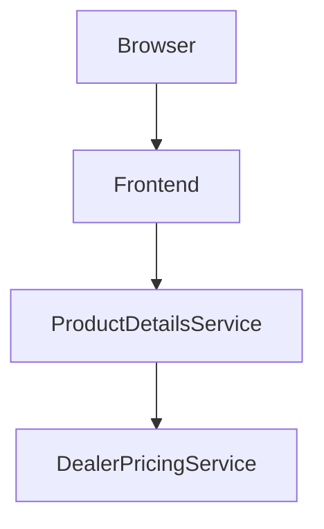

# 🛍️ Product Pricing Microservices Application

This project demonstrates a full-stack microservices architecture using **React (frontend)**, **Python Flask (Product Details Service)**, and **Node.js Express (Dealer Pricing Service)**, orchestrated using **Docker** and **Kubernetes** for local deployment.

---

## 📚 Table of Contents

* [Project Overview](#project-overview)
* [Architecture](#architecture)
* [Features](#features)
* [Prerequisites](#prerequisites)
* [Setup Instructions](#setup-instructions)

  * [Clone the Repository](#clone-the-repository)
  * [Build Docker Images](#build-docker-images)
  * [Deploy to Kubernetes](#deploy-to-kubernetes)
* [Accessing the Application](#accessing-the-application)
* [Microservices Details](#microservices-details)

  * [Product Details Service (Python Flask)](#product-details-service-python-flask)
  * [Dealer Pricing Service (Node.js Express)](#dealer-pricing-service-nodejs-express)
  * [Frontend (React)](#frontend-react)
* [Cleanup](#cleanup)
* [Troubleshooting](#troubleshooting)

---

## 🚀 Project Overview

This application simulates a product pricing system:

* The **React frontend** displays product info.
* The **Flask backend** (Product Details Service) serves product data.
* The **Express backend** (Dealer Pricing Service) provides pricing details.

All services are containerized and deployed locally using Kubernetes.

---

## 🏗️ Architecture

This project follows a microservices pattern:

* **Frontend**: React app (UI)
* **Product Details Service**: Flask app (product info)
* **Dealer Pricing Service**: Express app (pricing data)

Service-to-service communication is via HTTP.



---

## ✨ Features

* 📦 Modular microservices architecture
* ⚙️ Service-to-service communication over HTTP
* 🐳 Docker containerization
* ☸️ Kubernetes orchestration
* 🔁 Easily scalable and maintainable

---

## ✅ Prerequisites

Ensure the following tools are installed:

* [Git](https://git-scm.com/)
* [Docker Desktop](https://www.docker.com/products/docker-desktop/) (with Kubernetes enabled)
* [kubectl](https://kubernetes.io/docs/tasks/tools/install-kubectl/)

> ⚠️ Make sure Kubernetes is enabled inside Docker Desktop settings.

---

## ⚙️ Setup Instructions

### 📥 Clone the Repository

```bash
git clone https://github.com/johnwesley755/dealer-evaluation-application.git
cd dealer-evaluation-application
```

### 🏗️ Build Docker Images

From the root directory, build all services:

```bash
docker build -t product-details ./product-details
docker build -t dealer-pricing ./dealer-pricing
docker build -t frontend ./frontend
```

### 🚢 Deploy to Kubernetes

Apply the Kubernetes YAML files:

```bash
kubectl apply -f kubernetes/product-details-deployment.yaml
kubectl apply -f kubernetes/product-details-service.yaml
kubectl apply -f kubernetes/dealer-pricing-deployment.yaml
kubectl apply -f kubernetes/dealer-pricing-service.yaml
kubectl apply -f kubernetes/frontend-deployment.yaml
kubectl apply -f kubernetes/frontend-service.yaml
```

Check pod and service status:

```bash
kubectl get pods
kubectl get services
```

---

## 🌐 Accessing the Application

To access the frontend, get the NodePort:

```bash
kubectl get service frontend-service
```

Look for a port mapping like `3000:3XXXX/TCP`. Visit the app at:

```
http://localhost:3XXXX
```

(Replace `3XXXX` with your actual NodePort.)

---

## 🧩 Microservices Details

### 📘 Product Details Service (Python Flask)

* **Path**: `product-details/`
* **Function**: Returns product info and calls the Dealer Pricing service.
* **Run File**: `app.py`
* **Dependencies**: `requirements.txt`
* **Dockerfile**: Sets up Python, installs dependencies, and runs the Flask app.

---

### 💰 Dealer Pricing Service (Node.js Express)

* **Path**: `dealer-pricing/`
* **Function**: Simulates dealer-specific pricing.
* **Run File**: `server.js`
* **Dependencies**: `package.json`
* **Dockerfile**: Uses Node.js to install dependencies and start the server.

---

### 🎨 Frontend (React)

* **Path**: `frontend/`
* **Function**: User interface that calls the Product Details API.
* **Dependencies**: `package.json`
* **Dockerfile**: Builds the React app and serves it via a static web server (e.g., `nginx` or `serve`).

---

## 🧹 Cleanup

To delete all deployed resources:

```bash
kubectl delete -f kubernetes/product-details-deployment.yaml
kubectl delete -f kubernetes/product-details-service.yaml
kubectl delete -f kubernetes/dealer-pricing-deployment.yaml
kubectl delete -f kubernetes/dealer-pricing-service.yaml
kubectl delete -f kubernetes/frontend-deployment.yaml
kubectl delete -f kubernetes/frontend-service.yaml
```

---

## 🛠️ Troubleshooting

* **Docker Build Fails**:

  * Ensure Docker is running.
  * Verify that `Dockerfile` paths and build contexts are correct.

* **Pods Not Starting**:

  * Use:

    ```bash
    kubectl describe pod <pod-name>
    kubectl logs <pod-name>
    ```

* **Frontend Not Loading**:

  * Double-check NodePort and service name.
  * Confirm all services are up using `kubectl get all`.

* **Cross-Service Communication Fails**:

  * Ensure internal service names (`http://dealer-pricing-service:PORT`) match those defined in the Kubernetes Service manifests.

---

